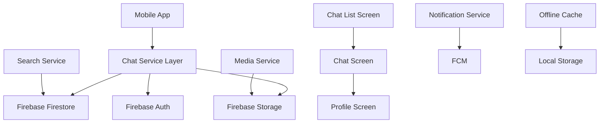

# Enhanced Chat Features Design Document

## Overview

This design document outlines the architecture and implementation approach for comprehensive chat features in the Fixo application. The solution leverages Firebase for real-time synchronization, implements efficient data structures for performance, and provides a rich user experience across both homeowner and tradie user types.

## Architecture

### High-Level Architecture



### Data Architecture

#### Firestore Collections Structure

```
/chats/{chatId}
  - participants: [userId1, userId2]
  - participantTypes: [userType1, userType2]
  - lastMessage: string
  - lastMessageTimestamp: timestamp
  - lastSenderId: string
  - jobId: string (optional)
  - jobTitle: string (optional)
  - isArchived: boolean
  - isBlocked: boolean
  - blockedBy: string (optional)
  - createdAt: timestamp
  - updatedAt: timestamp

/messages/{messageId}
  - chatId: string
  - senderId: string
  - receiverId: string
  - senderUserType: string
  - receiverUserType: string
  - message: string
  - messageType: enum [text, image, system]
  - imageUrl: string (optional)
  - imageThumbnail: string (optional)
  - timestamp: timestamp
  - read: boolean
  - isDeleted: boolean
  - isUnsent: boolean
  - deletedBy: string (optional)

/typing/{chatId}
  - typingUsers: map<userId, timestamp>

/userProfiles/{userId}
  - displayName: string
  - avatar: string
  - userType: string
  - ratings: number
  - reviewCount: number
  - jobHistory: array
  - isBlocked: boolean
  - blockedUsers: array<userId>

/reports/{reportId}
  - reporterId: string
  - reportedUserId: string
  - chatId: string
  - reason: string
  - description: string
  - timestamp: timestamp
  - status: enum [pending, reviewed, resolved]
```

## Components and Interfaces

### 1. Chat List Component

#### ChatListScreen
- **Purpose**: Display organized list of all user chats
- **Key Features**:
  - Real-time chat updates
  - Unread message indicators
  - Search functionality
  - Archive/Active tab separation
  - Pull-to-refresh

#### ChatListItem Widget
```dart
class ChatListItem extends StatelessWidget {
  final ChatModel chat;
  final int unreadCount;
  final bool isArchived;
  final VoidCallback onTap;
  final VoidCallback onLongPress;
}
```

### 2. Enhanced Chat Screen

#### ChatScreen (Enhanced)
- **Purpose**: Main chat interface with all messaging features
- **New Features**:
  - Typing indicators
  - Image sharing
  - Enhanced message options
  - Profile access
  - Block/Report functionality

#### TypingIndicator Widget
```dart
class TypingIndicator extends StatefulWidget {
  final String userName;
  final bool isVisible;
}
```

#### ImageMessage Widget
```dart
class ImageMessage extends StatelessWidget {
  final String imageUrl;
  final String thumbnailUrl;
  final bool isMe;
  final VoidCallback onTap;
}
```

### 3. Search Components

#### ChatSearchDelegate
```dart
class ChatSearchDelegate extends SearchDelegate<ChatModel> {
  final List<ChatModel> chats;
  final Function(String) onSearch;
}
```

#### MessageSearchScreen
- **Purpose**: Advanced search within specific chats
- **Features**:
  - Keyword highlighting
  - Filter by date range
  - Jump to message context

### 4. Profile Components

#### UserProfileScreen
```dart
class UserProfileScreen extends StatefulWidget {
  final String userId;
  final String userType;
  final bool canBlock;
  final bool canReport;
}
```

#### ProfileHeader Widget
- Display user avatar, name, ratings
- Action buttons (Block, Report, Call)

#### ProfileStats Widget
- Job completion stats
- Rating breakdown
- Review highlights

### 5. Media Components

#### ImagePicker Service
```dart
class MediaService {
  Future<File?> pickImageFromGallery();
  Future<File?> captureImageFromCamera();
  Future<String> uploadImage(File image, String chatId);
  Future<String> generateThumbnail(File image);
}
```

#### ImageViewer Screen
- Full-screen image display
- Zoom and pan capabilities
- Share and save options

## Data Models

### Enhanced Models

#### ChatModel
```dart
class ChatModel {
  final String id;
  final List<String> participants;
  final List<String> participantTypes;
  final String lastMessage;
  final DateTime lastMessageTimestamp;
  final String lastSenderId;
  final String? jobId;
  final String? jobTitle;
  final bool isArchived;
  final bool isBlocked;
  final String? blockedBy;
  final int unreadCount;
  final UserModel otherUser;
}
```

#### Enhanced MessageModel
```dart
class MessageModel {
  final String id;
  final String chatId;
  final String senderId;
  final String receiverId;
  final String senderUserType;
  final String receiverUserType;
  final String message;
  final MessageType messageType;
  final String? imageUrl;
  final String? imageThumbnail;
  final DateTime timestamp;
  final bool read;
  final bool isDeleted;
  final bool isUnsent;
  final String? deletedBy;
}

enum MessageType { text, image, system }
```

#### UserProfileModel
```dart
class UserProfileModel {
  final String id;
  final String displayName;
  final String? avatar;
  final String userType;
  final double ratings;
  final int reviewCount;
  final List<JobHistoryItem> jobHistory;
  final bool isBlocked;
  final DateTime? lastSeen;
}
```

## Error Handling

### Error Categories

1. **Network Errors**
   - Connection timeout
   - No internet connectivity
   - Firebase service unavailable

2. **Permission Errors**
   - Camera/gallery access denied
   - Storage permission denied
   - Microphone access denied

3. **Validation Errors**
   - Invalid file formats
   - File size limits exceeded
   - Empty message content

4. **Business Logic Errors**
   - Blocked user interactions
   - Archived chat modifications
   - Invalid user permissions

### Error Handling Strategy

```dart
class ChatErrorHandler {
  static void handleError(ChatError error, BuildContext context) {
    switch (error.type) {
      case ChatErrorType.network:
        _showNetworkError(context);
        break;
      case ChatErrorType.permission:
        _showPermissionError(context, error.permission);
        break;
      case ChatErrorType.validation:
        _showValidationError(context, error.message);
        break;
      case ChatErrorType.blocked:
        _showBlockedUserError(context);
        break;
    }
  }
}
```

## Testing Strategy

### Unit Testing

1. **Service Layer Tests**
   - ChatService methods
   - MediaService functionality
   - SearchService algorithms
   - UserProfileService operations

2. **Model Tests**
   - Data serialization/deserialization
   - Model validation
   - CopyWith methods

3. **Utility Tests**
   - Date formatting
   - Image processing
   - Search algorithms

### Integration Testing

1. **Firebase Integration**
   - Real-time data synchronization
   - File upload/download
   - Authentication flows

2. **UI Integration**
   - Chat flow end-to-end
   - Search functionality
   - Profile navigation

### Widget Testing

1. **Chat Components**
   - Message rendering
   - Typing indicators
   - Image display

2. **List Components**
   - Chat list rendering
   - Search results
   - Profile information

## Performance Considerations

### Optimization Strategies

1. **Data Loading**
   - Implement pagination for chat lists
   - Lazy loading for message history
   - Efficient image caching

2. **Real-time Updates**
   - Debounced typing indicators
   - Optimized Firestore listeners
   - Selective UI updates

3. **Memory Management**
   - Image compression and caching
   - Dispose of unused streams
   - Efficient list rendering

4. **Network Optimization**
   - Image thumbnail generation
   - Offline message queuing
   - Retry mechanisms

### Caching Strategy

```dart
class ChatCacheManager {
  static const String CHAT_LIST_KEY = 'chat_list';
  static const String MESSAGE_CACHE_KEY = 'messages_';
  static const String PROFILE_CACHE_KEY = 'profile_';
  
  Future<void> cacheChats(List<ChatModel> chats);
  Future<List<ChatModel>?> getCachedChats();
  Future<void> cacheMessages(String chatId, List<MessageModel> messages);
  Future<void> cacheUserProfile(String userId, UserProfileModel profile);
}
```

## Security Considerations

### Data Protection

1. **User Privacy**
   - Encrypted message storage
   - Secure image URLs with expiration
   - Privacy-compliant user profiles

2. **Access Control**
   - User-specific data filtering
   - Blocked user enforcement
   - Report system integrity

3. **Content Moderation**
   - Automated content scanning
   - Report escalation workflows
   - User safety measures

### Firebase Security Rules

```javascript
// Firestore Security Rules
rules_version = '2';
service cloud.firestore {
  match /databases/{database}/documents {
    // Chat access rules
    match /chats/{chatId} {
      allow read, write: if request.auth != null && 
        request.auth.uid in resource.data.participants;
    }
    
    // Message access rules
    match /messages/{messageId} {
      allow read: if request.auth != null && 
        (request.auth.uid == resource.data.senderId || 
         request.auth.uid == resource.data.receiverId);
      allow create: if request.auth != null && 
        request.auth.uid == request.resource.data.senderId;
    }
    
    // Profile access rules
    match /userProfiles/{userId} {
      allow read: if request.auth != null;
      allow write: if request.auth != null && 
        request.auth.uid == userId;
    }
  }
}
```

## Implementation Phases

### Phase 1: Core Infrastructure
- Enhanced data models
- Firebase collection structure
- Basic service layer updates

### Phase 2: Chat List Enhancement
- Chat list screen redesign
- Search functionality
- Unread indicators

### Phase 3: Advanced Chat Features
- Typing indicators
- Image sharing
- Enhanced message options

### Phase 4: User Management
- Profile screens
- Block/Report functionality
- User safety features

### Phase 5: Performance & Polish
- Caching implementation
- Performance optimization
- UI/UX refinements