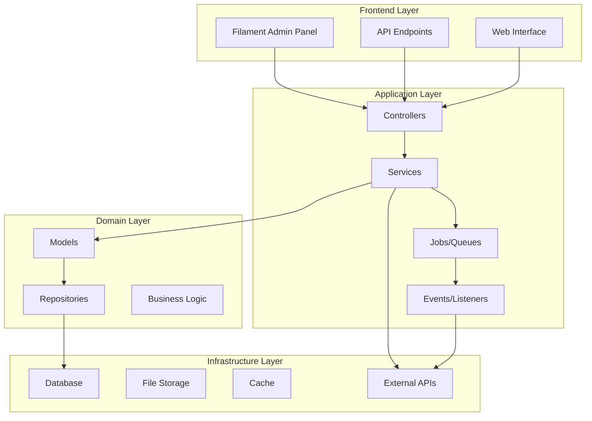

# Design Document

## Overview

The Tradie Marketplace Platform is built on Laravel 12 with Filament 4 for admin management. The system uses a multi-tenant architecture supporting three user types: homeowners, tradies, and admins. The platform leverages Laravel's built-in authentication, queue system for background processing, and integrates with external APIs for payments and notifications.

## Architecture

### High-Level Architecture



### System Components

- **Laravel Framework**: Core application framework
- **Filament Admin Panel**: Administrative interface for platform management
- **MySQL Database**: Primary data storage
- **Redis Cache**: Session storage and caching
- **Laravel Queue**: Background job processing
- **Laravel Sanctum**: API authentication
- **BNZ Payment API**: Payment processing integration
- **File Storage**: Document and image management

## Components and Interfaces

### User Management System

**UserService**
- Handles registration, authentication, and profile management
- Manages user roles and permissions
- Integrates with social login providers (Google, Facebook)

**ProfileService**
- Manages user profile information
- Handles tradie professional credentials and verification
- Manages homeowner preferences and history

### Job Management System

**JobService**
- Handles job creation, updates, and lifecycle management
- Manages job applications and assignments
- Coordinates between homeowners and tradies

**MatchingService**
- Implements recommendation algorithms
- Matches tradies to jobs based on skills, location, and availability
- Provides search and filtering capabilities

### Communication System

**ChatService**
- Manages real-time messaging between users
- Stores conversation history
- Handles message notifications and moderation

**NotificationService**
- Sends email, SMS, and in-app notifications
- Manages notification preferences
- Handles automated reminders and alerts

### Payment System

**PaymentService**
- Integrates with BNZ payment APIs
- Manages escrow functionality for milestone payments
- Handles refunds and dispute resolution
- Tracks payment history and reconciliation

### Scheduling System

**SchedulingService**
- Manages appointment booking and calendar integration
- Sends automated reminders
- Handles schedule conflicts and updates

### Review System

**ReviewService**
- Manages reviews and ratings for both tradies and homeowners
- Calculates weighted ratings and reputation scores
- Handles review moderation and dispute resolution

## Data Models

### Core Entities

**User Model** (Admin only)
```php
- id: bigint (primary key)
- name: string
- email: string (unique)
- email_verified_at: timestamp (nullable)
- password: string
- status: enum (active, inactive, suspended)
- created_at: timestamp
- updated_at: timestamp
```

**Homeowner Model**
```php
- id: bigint (primary key)
- name: string
- email: string (unique)
- phone: string (nullable)
- email_verified_at: timestamp (nullable)
- password: string
- avatar: string (nullable)
- bio: text (nullable)
- address: text (nullable)
- city: string (nullable)
- region: string (nullable)
- postal_code: string (nullable)
- latitude: decimal (nullable)
- longitude: decimal (nullable)
- status: enum (active, inactive, suspended)
- created_at: timestamp
- updated_at: timestamp
```

**Tradie Model**
```php
- id: bigint (primary key)
- name: string
- email: string (unique)
- phone: string (nullable)
- email_verified_at: timestamp (nullable)
- password: string
- avatar: string (nullable)
- bio: text (nullable)
- address: text (nullable)
- city: string (nullable)
- region: string (nullable)
- postal_code: string (nullable)
- latitude: decimal (nullable)
- longitude: decimal (nullable)
- business_name: string (nullable)
- license_number: string (nullable)
- insurance_details: text (nullable)
- years_experience: integer (nullable)
- hourly_rate: decimal (nullable)
- availability_status: enum (available, busy, unavailable)
- service_radius: integer (default 50)
- verified_at: timestamp (nullable)
- status: enum (active, inactive, suspended)
- created_at: timestamp
- updated_at: timestamp
```

**Service Model**
```php
- id: bigint (primary key)
- name: string
- description: text (nullable)
- category: string
- is_active: boolean (default true)
- created_at: timestamp
- updated_at: timestamp
```

**TradieService Model** (Pivot)
```php
- id: bigint (primary key)
- tradie_profile_id: bigint (foreign key)
- service_id: bigint (foreign key)
- base_rate: decimal (nullable)
- created_at: timestamp
- updated_at: timestamp
```

**Job Model**
```php
- id: bigint (primary key)
- homeowner_id: bigint (foreign key)
- title: string
- description: text
- service_id: bigint (foreign key)
- budget_min: decimal (nullable)
- budget_max: decimal (nullable)
- address: text
- city: string
- region: string
- postal_code: string
- latitude: decimal (nullable)
- longitude: decimal (nullable)
- preferred_start_date: date (nullable)
- urgency: enum (low, medium, high, urgent)
- status: enum (draft, posted, assigned, in_progress, completed, cancelled)
- created_at: timestamp
- updated_at: timestamp
```

**JobApplication Model**
```php
- id: bigint (primary key)
- job_id: bigint (foreign key)
- tradie_id: bigint (foreign key)
- quoted_price: decimal
- estimated_duration: string (nullable)
- message: text (nullable)
- status: enum (pending, accepted, rejected, withdrawn)
- applied_at: timestamp
- created_at: timestamp
- updated_at: timestamp
```

**Booking Model**
```php
- id: bigint (primary key)
- job_id: bigint (foreign key)
- tradie_id: bigint (foreign key)
- homeowner_id: bigint (foreign key)
- scheduled_date: datetime
- estimated_duration: integer (minutes)
- actual_start_time: datetime (nullable)
- actual_end_time: datetime (nullable)
- status: enum (scheduled, in_progress, completed, cancelled, no_show)
- notes: text (nullable)
- created_at: timestamp
- updated_at: timestamp
```

**Payment Model**
```php
- id: bigint (primary key)
- booking_id: bigint (foreign key)
- amount: decimal
- payment_type: enum (deposit, milestone, final, refund)
- payment_method: string
- transaction_id: string (nullable)
- status: enum (pending, processing, completed, failed, refunded)
- processed_at: timestamp (nullable)
- created_at: timestamp
- updated_at: timestamp
```

**Review Model**
```php
- id: bigint (primary key)
- booking_id: bigint (foreign key)
- reviewer_id: bigint (foreign key)
- reviewee_id: bigint (foreign key)
- rating: integer (1-5)
- title: string (nullable)
- comment: text (nullable)
- is_verified: boolean (default false)
- created_at: timestamp
- updated_at: timestamp
```

**Message Model**
```php
- id: bigint (primary key)
- booking_id: bigint (foreign key)
- sender_id: bigint (foreign key)
- receiver_id: bigint (foreign key)
- message: text
- is_read: boolean (default false)
- read_at: timestamp (nullable)
- created_at: timestamp
- updated_at: timestamp
```

### Supporting Models

**Notification Model**
```php
- id: bigint (primary key)
- user_id: bigint (foreign key)
- type: string
- title: string
- message: text
- data: json (nullable)
- read_at: timestamp (nullable)
- created_at: timestamp
- updated_at: timestamp
```

**UserFavorite Model**
```php
- id: bigint (primary key)
- user_id: bigint (foreign key)
- favorited_user_id: bigint (foreign key)
- created_at: timestamp
- updated_at: timestamp
```

## Error Handling

### Exception Hierarchy

- **TradieMarketplaceException**: Base exception class
- **UserNotFoundException**: When user lookup fails
- **JobNotFoundException**: When job lookup fails
- **PaymentException**: Payment processing errors
- **ValidationException**: Input validation failures
- **AuthorizationException**: Permission denied errors

### Error Response Format

```json
{
    "success": false,
    "error": {
        "code": "VALIDATION_ERROR",
        "message": "The given data was invalid.",
        "details": {
            "field": ["error message"]
        }
    }
}
```

### Logging Strategy

- **Error Level**: System errors, payment failures, security issues
- **Warning Level**: Business rule violations, rate limiting
- **Info Level**: User actions, job state changes
- **Debug Level**: API calls, query performance

## Testing Strategy

### Unit Testing

- **Model Tests**: Validate relationships, scopes, and business logic
- **Service Tests**: Test business logic and external integrations
- **Repository Tests**: Verify data access patterns
- **Job Tests**: Background job processing validation

### Integration Testing

- **API Tests**: End-to-end API functionality
- **Payment Tests**: BNZ API integration testing
- **Notification Tests**: Email and SMS delivery
- **Authentication Tests**: Login flows and permissions

### Feature Testing

- **Job Workflow Tests**: Complete job lifecycle testing
- **User Registration Tests**: Multi-provider authentication
- **Search and Matching Tests**: Algorithm accuracy
- **Review System Tests**: Rating calculations and moderation

### Performance Testing

- **Database Query Optimization**: N+1 query prevention
- **API Response Times**: Sub-200ms response targets
- **Concurrent User Testing**: Load testing for peak usage
- **Cache Effectiveness**: Redis cache hit rates

### Security Testing

- **Authentication Testing**: Session management and token validation
- **Authorization Testing**: Role-based access control
- **Input Validation**: SQL injection and XSS prevention
- **Payment Security**: PCI compliance and secure transactions

### Test Data Management

- **Factories**: Laravel model factories for test data generation
- **Seeders**: Consistent test environment setup
- **Database Transactions**: Isolated test execution
- **Mock Services**: External API mocking for reliable tests